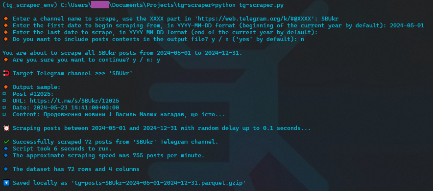
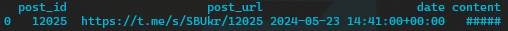

# Telegram Posts Scraper

The `tg-scraper.py` script is used to scrape posts from a given telegram channel and write the output into a compressed parquet file (_built around snscrape module_).

Upon running the script will ask for the `XXXX` part in `https://web.telegram.org/k/#@XXXX`, as well as 2 date parameters which are used to specify the point in time when the scraping should begin and end.

The script also has an additional option to mask posts contents in the output file with `#####`, this can be done by chosing the respective option when prompted.

 Script run example 

 Script output file example 

