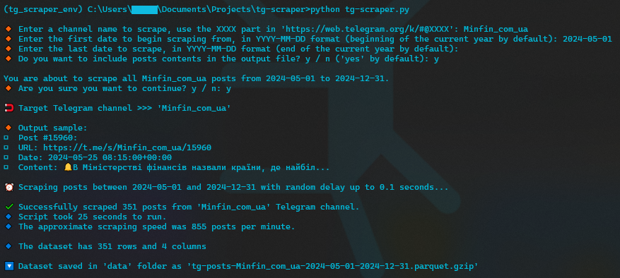

# Telegram Posts Scraper

## 1. App

A standalone application for a telegram channel posts scraping, built on top of a [`tg-scraper.py`](#2-script). The output is produced in a `.parquet.gzip` format.

### How to use:
  1. Download [tg-scraper-app.exe](https://github.com/cyterat/tg-scraper/blob/main/tg-scraper-app.exe).
  2. Run the application.
  3. Now its ready to use.

Application window

***

## 2. Script

The `tg-scraper.py` script is used to scrape posts from a given telegram channel and write the output into a compressed parquet file (_built around snscrape module_).

Upon running the script will ask for the `XXXX` part in `https://web.telegram.org/k/#@XXXX`, as well as 2 date parameters which are used to specify the dates of first and the last posts to scrape.

The script also has an additional option to mask posts contents in the output file with `#####`, this can be done by chosing the respective option when prompted.

Script run example

Script output file example

